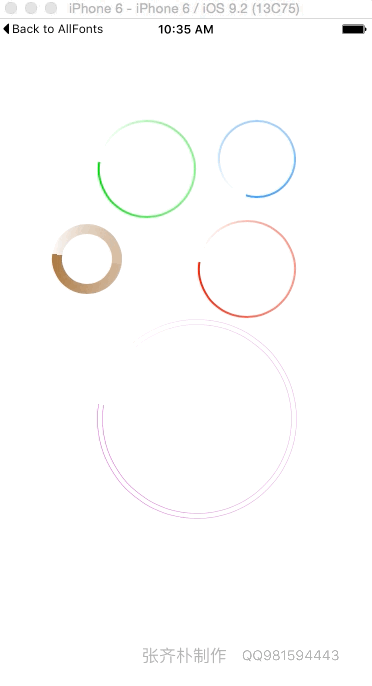

# WaitingHUD
---

    WaitingView *waitingView = [[WaitingView alloc] initWithFrame:CGRectMake(100, 100, 100, 100)];
    waitingView.color = [UIColor greenColor]; // 设定颜色
    waitingView.speed = 2; // 设定速度 (0 - 100)
    waitingView.thickness = 0.5; // 粗细
    [self.view addSubview:waitingView];
    [waitingView startAnimation];
---

